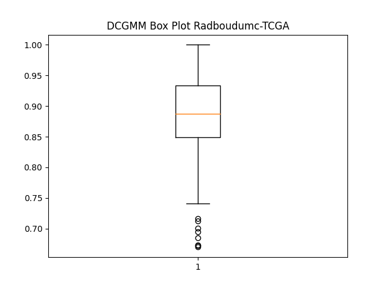
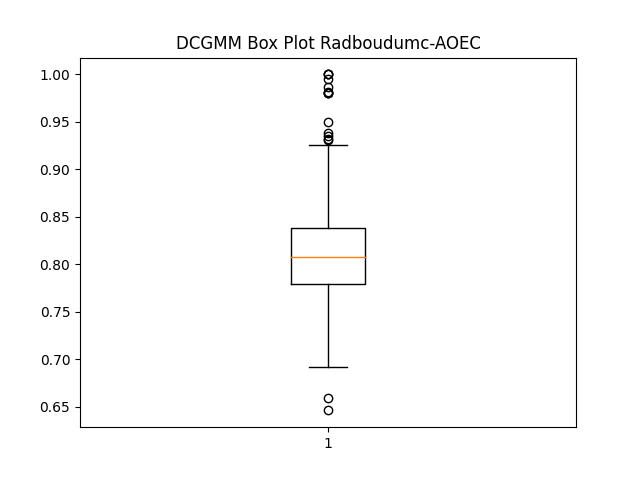
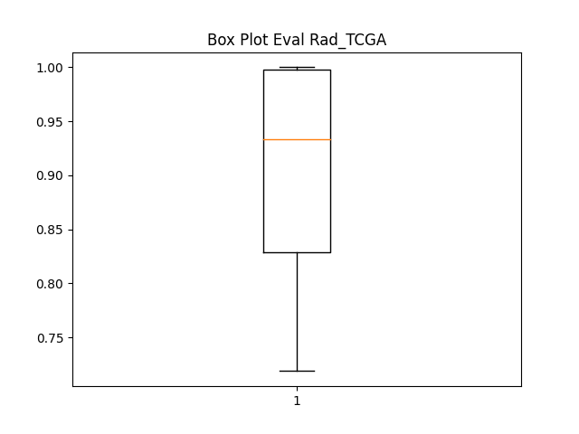
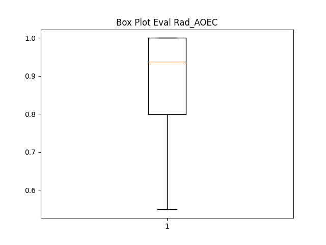

# WP3 - EXAMODE COLOR INFORMATION with Residual Flows for Invertible Generative Modeling 

## Based on paper
```
@inproceedings{chen2019residualflows,
  title={Residual Flows for Invertible Generative Modeling},
  author={Chen, Ricky T. Q. and Behrmann, Jens and Duvenaud, David and Jacobsen, J{\"{o}}rn{-}Henrik},
  booktitle = {Advances in Neural Information Processing Systems},
  year={2019}
}
```

- Flow-based generative models parameterize probability distributions through an
invertible transformation and can be trained by maximum likelihood. Invertible
residual networks provide a flexible family of transformations where only Lipschitz
conditions rather than strict architectural constraints are needed for enforcing
invertibility.
- This application concerns the invertible mapping of the color information in histopathology Whole Slide Image patches


- Color Information measures can be evaluated using: 
    - Normalized Median Intensity (NMI) measure
    - Standard deviation of NMI
    - Coefficient of variation of NMI
    
    ref: <a href="https://pubmed.ncbi.nlm.nih.gov/26353368/">Stain Specific Standardization of Whole-Slide Histopathological Images</a>


<p align="center">
 ==> 


 ==> 


 ==> 
</p>  
> The tissue class membership, followed by conversion


## Analysis of Normalized Median Intensity (NMI -  scores)

|        | RadboudUMC (template) - TCGA (target)     |  RadboudUMC (template) - AOEC (target) |
|:------:|:-------------------------:|:-------------------------:|
| DCGMM  |  |  |
|iResFlow|  |  |

> Circles are outliers.

### RadboudUMC (template) - TCGA (target)
| **Model**|**NMI - Standard Deviation**|**NMI - Coefficient of Variation**|
|:--------:|:------------:|:-----------------:|
|   DCGMM  |   0.0686 +- 0.0065     |  0.0776 +- 0.0110 |
| iResFlow |   0.0381 +- 0.0094     |  0.0425 +- 0.0148 |

### RadboudUMC (template) - AOEC (target)
| **Model**|**NMI - Standard Deviation**|**NMI - Coefficient of Variation**|
|:--------:|:------------:|:-----------------:|
|   DCGMM  |   0.0547 +- 0.0222    | 0.0670 +- 0.0249 |
| iResFlow |   0.0497 +- 0.0126    | 0.0563 +- 0.0170  |

> NMI_SD / NMI_CV metrics based on 5 runs of 100 256 x 256 patches of RadboudUMC (template), AOEC (target), TCGA (target) data


## Semantic Segmentation Comparison with DCGMM              
| **Model**|**Parameters**|**Validation mIoU**|
|:--------:|:------------:|:-----------------:|
|   DCGMM  |   517233     |  0.7928 +- 0.0413 |
| iResFlow |   500388     |  0.8477 +- 0.0237 |


> Comparison done on CAMLEYON17 with RadboudUMC data (template), medical center 1 patches of 256 x 256, 4 independent runs of 50 epochs


<p align="center">
 <==> 


 <==> 
</p>  

> Left: DCGMM | Right: iResFlow


# Setup
These steps ran on LISA this module environment, where we first clone and enable the 2020 software stack: 

```
cd ~
git clone https://git.ia.surfsara.nl/environment-modules/environment-modules-lisa.git
```

Load Modules:
```
module purge
module use ~/environment-modules-lisa
module load 2020
module load TensorFlow/2.1.0-foss-2019b-Python-3.7.4-CUDA-10.1.243
```
Set Environment Variables:
```
# Setting ENV variables
export HOROVOD_CUDA_HOME=$CUDA_HOME
export HOROVOD_CUDA_INCLUDE=$CUDA_HOME/include
export HOROVOD_CUDA_LIB=$CUDA_HOME/lib64
export HOROVOD_NCCL_HOME=$EBROOTNCCL
export HOROVOD_GPU_ALLREDUCE=NCCL
# Export MPICC
export MPICC=mpicc
export MPICXX=mpicpc
export HOROVOD_MPICXX_SHOW="mpicxx --showme:link"
export HOROVOD_WITH_PYTORCH=1
```


Install requirements:
```
pip install -r requirements.txt
```

Options:


```
python train_img_horo.py --help

>>>>>
Residual Flow Model Color Information

optional arguments:
  -h, --help            show this help message and exit
  --data {custom}
  --dataroot DATAROOT
  --nclusters NCLUSTERS
                        The amount of tissue classes trained upon (default: 4)
  --dataset DATASET     Which dataset to use. "16" for CAMELYON16 or "17" for
                        CAMELYON17 (default: 0)
  --train_centers TRAIN_CENTERS [TRAIN_CENTERS ...]
                        Centers for training. Use -1 for all, otherwise 2 3 4
                        eg. (default: [-1])
  --val_centers VAL_CENTERS [VAL_CENTERS ...]
                        Centers for validation. Use -1 for all, otherwise 2 3
                        4 eg. (default: [-1])
  --train_path TRAIN_PATH
                        Folder of where the training data is located (default:
                        None)
  --valid_path VALID_PATH
                        Folder where the validation data is located (default:
                        None)
  --val_split VAL_SPLIT
  --debug               If running in debug mode (default: False)
  --fp16_allreduce      If all reduce in fp16 (default: False)
  --imagesize IMAGESIZE
  --nbits NBITS
  --block {resblock,coupling}
  --coeff COEFF
  --vnorms VNORMS
  --n-lipschitz-iters N_LIPSCHITZ_ITERS
  --sn-tol SN_TOL
  --learn-p {True,False}
                        Learn Lipschitz norms, see paper (default: False)
  --n-power-series N_POWER_SERIES
                        Amount of power series evaluated, see paper (default:
                        None)
  --factor-out {True,False}
                        Factorize dimensions, see paper (default: False)
  --n-dist {geometric,poisson}
  --n-samples N_SAMPLES
  --n-exact-terms N_EXACT_TERMS
                        Exact terms computed in series estimation, see paper
                        (default: 2)
  --var-reduc-lr VAR_REDUC_LR
  --neumann-grad {True,False}
                        Neumann gradients, see paper (default: True)
  --mem-eff {True,False}
                        Memory efficient backprop, see paper (default: True)
  --act {softplus,elu,swish,lcube,identity,relu}
  --idim IDIM
  --nblocks NBLOCKS
  --squeeze-first {True,False}
  --actnorm {True,False}
  --fc-actnorm {True,False}
  --batchnorm {True,False}
  --dropout DROPOUT
  --fc {True,False}
  --kernels KERNELS
  --add-noise {True,False}
  --quadratic {True,False}
  --fc-end {True,False}
  --fc-idim FC_IDIM
  --preact {True,False}
  --padding PADDING
  --first-resblock {True,False}
  --cdim CDIM
  --optimizer {adam,adamax,rmsprop,sgd}
  --scheduler {True,False}
  --nepochs NEPOCHS     Number of epochs for training (default: 1000)
  --batchsize BATCHSIZE
                        Minibatch size (default: 64)
  --lr LR               Learning rate (default: 0.001)
  --wd WD               Weight decay (default: 0)
  --warmup-iters WARMUP_ITERS
  --annealing-iters ANNEALING_ITERS
  --save SAVE           directory to save results (default: experiment1)
  --val-batchsize VAL_BATCHSIZE
                        minibatch size (default: 200)
  --seed SEED
  --ema-val {True,False}
                        Use exponential moving averages of parameters at
                        validation. (default: False)
  --update-freq UPDATE_FREQ
  --task {density,classification,hybrid,gmm}
  --scale-dim {True,False}
  --rcrop-pad-mode {constant,reflect}
  --padding-dist {uniform,gaussian}
  --resume RESUME
  --save_conv SAVE_CONV
                        Save converted images. (default: False)
  --begin-epoch BEGIN_EPOCH
  --nworkers NWORKERS
  --print-freq PRINT_FREQ
                        Print progress every so iterations (default: 1)
  --vis-freq VIS_FREQ   Visualize progress every so iterations (default: 5)
  --save-every SAVE_EVERY
                        VSave model every so epochs (default: 1)
```
### Training
```
# CAMELYON17

mpirun -map-by ppr:4:node -np $np -x LD_LIBRARY_PATH -x PATH python -u train_img_horo.py \
 --data custom \
 --dataset 17 \             # CAMELYON 17
 --train_centers 1 \
 --val_centers 1 \
 --train_path /nfs/managed_datasets/CAMELYON17/training/center_XX \
 --valid_path /nfs/managed_datasets/CAMELYON17/training/center_XX \
 --val_split 0.2 \
 --imagesize 256 \
 --batchsize 4 \
 --val-batchsize 4 \
 --actnorm True \
 --nbits 8 \
 --act swish \              # Swish activation
 --update-freq 1 \
 --n-exact-terms 8 \
 --fc-end False \
 --squeeze-first False \
 --factor-out True \
 --save experiments/test \
 --nblocks 16 \             # 1 residual block of length 16
 --vis-freq 50              # Visualize every 50 iterations
 --nepochs 5
 
# CUSTOM DATA

mpirun -map-by ppr:4:node -np $np -x LD_LIBRARY_PATH -x PATH python -u train_img_horo.py \
 --data custom \
 --train_path /home/rubenh/examode/deeplab/CAMELYON16_PREPROCESSING/Radboudumc \
 --valid_path /home/rubenh/examode/deeplab/CAMELYON16_PREPROCESSING/Radboudumc \
 --val_split 0.2 \
 --imagesize 256 \
 --batchsize 4 \
 --val-batchsize 4 \
 --actnorm True \
 --nbits 8 \
 --act swish \
 --update-freq 1 \
 --n-exact-terms 8 \
 --fc-end False \
 --squeeze-first False \
 --factor-out True \
 --save experiments/test \
 --nblocks 16 \
 --vis-freq 50 \             
 --nepochs 5
 
```

- This will train the invertible resnet for 5 epochs, and save visualisations and checkpoints in `experiments/test`.
    
    

### Evaluation
```
# CUSTOM DATA

 mpirun -map-by ppr:4:node -np 8 -x LD_LIBRARY_PATH -x PATH python -u train_img_horo.py \
 --data custom \
 --fp16_allreduce \
 --train_path /home/rubenh/examode/deeplab/CAMELYON16_PREPROCESSING/Radboudumc \    # Insert template path
 --valid_path /home/rubenh/examode/deeplab/CAMELYON16_PREPROCESSING/TCGA \          # Insert target path  
 --imagesize 256 \
 --batchsize 4 \
 --val-batchsize 4 \
 --actnorm True \
 --nbits 8 \
 --act swish \
 --update-freq 1 \
 --n-exact-terms 8 \
 --fc-end False \
 --squeeze-first False \
 --factor-out True \
 --save experiments/test \
 --nblocks 21 \                                                                     # Make sure model is as large as checkpoint
 --nclusters 3 \                                                                    # Check no. of clusters of checkpoint
 --vis-freq 10 \
 --nepochs 5 \
 --resume /home/rubenh/examode/color-information/checkpoints/Radboudumc_8_workers.pth \
 --save_conv False                                                                  # Set to save converted images

# CAMELYON17

mpirun -map-by ppr:4:node -np $np -x LD_LIBRARY_PATH -x PATH python -u train_img_horo.py \
 --data custom \
 --dataset 17 \             # CAMELYON 17
 --train_centers 1 \        # Use medical center 1 as template
 --val_centers 2 \          # Use medical center 2 as target of model deployment
 --train_path /nfs/managed_datasets/CAMELYON17/training/center_XX \
 --valid_path /nfs/managed_datasets/CAMELYON17/training/center_XX \
 --val_split 0.2 \
 --imagesize 256 \
 --batchsize 4 \
 --val-batchsize 4 \
 --actnorm True \
 --nbits 8 \
 --act swish \
 --update-freq 1 \
 --n-exact-terms 8 \
 --fc-end False \
 --squeeze-first False \
 --factor-out True \
 --save experiments/test \
 --nblocks 16 \
 --resume /home/rubenh/examode/color-information/experiments/gmm11/models/most_recent.pth                                                                # specify save path to save transformed images
```

### TODO
- [x] Implement multi node framework (Horovod)
- [ ] Implement SURFSampler to sample patches at runtime

